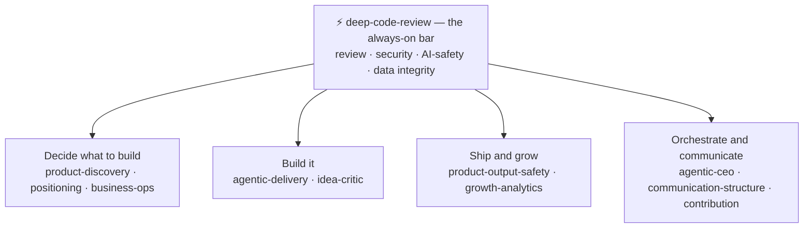
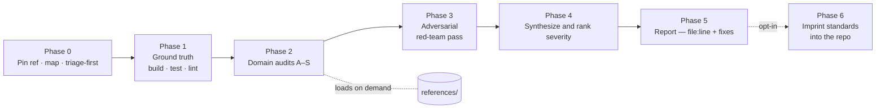

# Perun

### Bring the thunder to your codebase.

**An evidence-grounded quality bar for building with AI agents** — it strikes
down chaos, never fabricates, and leaves the bar in place. Named for the Slavic
thunder god of order and justice.

Perun's flagship is **`deep-code-review`**: a universal code-review skill you drop
into any repository. It turns "look this over" into a rigorous, reproducible audit
— correctness, security, AI/LLM safety, data quality, performance and cost,
reliability, testing, infrastructure, docs, accessibility — that ends with a
severity-ranked report you can act on. Works in any language or stack, on any
major coding agent (Cursor, Claude Code, Codex, Copilot, Gemini, Aider, …), as a
one-shot prompt, or as a plain human checklist. Opt-in overlays extend it into a
full product-building suite.

> [!NOTE]
> **New here?** Skim **[Who it's for](#who-its-for)**, then
> **[What's in the box](#whats-in-the-box)**. Ready to try it? **[Quickstart](#quickstart)**.

---

## Who it's for

| You are… | Perun gives you… | Start here |
|---|---|---|
| A **solo builder** shipping with AI agents | one consistent bar, so agent-written code is judged the same way every time | [Quickstart](#quickstart) |
| A **non-technical founder** | a plain-language health scorecard and the decisions that need *you* — without reading the code | [What you get](#what-you-get) |
| A **small team** | a portable software-house — review, gated delivery, and the roles a strong team runs — without a bot per role | [What's in the box](#whats-in-the-box) |
| A **platform / infra engineer** | an air-gapped, SHA-verified install and a bar you can imprint across many repos | [Quickstart](#quickstart) |

Every advisory overlay works on **your own inputs and evidence** and never
fabricates market, financial, or security facts — it structures your reasoning
and routes what it cannot know to you or a professional.

---

## The problem it solves

An ad-hoc read-through finds the obvious bugs and misses the expensive ones: the
IDOR that leaks another tenant's data, the enrichment run that silently
overwrites a verified value with a blank, the N+1 that shows up only under load,
the LLM call that trusts a scraped web page as an instruction, the migration that
locks a table during deploy, the API called "every run" that quietly grows the
bill.

Perun makes the review **systematic** — a fixed method, domain checklists mapped
to current standards, an adversarial pass, and a report format — so the same
rigor applies every time, on any project, by a human or an agent. Two things make
it more than a checklist:

- **It judges the outcome, not just the code.** For data and ML pipelines it
  audits what the code *produces* — fabrication, duplication, entity-merge errors,
  silent quality regressions — against a hard "quality can only improve, never
  silently degrade" invariant.
- **It leaves the bar in place.** An optional final phase imprints a tailored
  standards set — a canonical cross-vendor `AGENTS.md` (with `CLAUDE.md` and peer
  agent files as thin pointers to it), pre-commit/CI gates, and templates — so the
  *next* contributor or agent, of any vendor, holds the same bar without
  re-deriving it.

---

## What you get

- **A severity-ranked report** (Blocker → Critical → High → Medium → Low → Nit).
  Every finding carries `file:line` evidence and a concrete fix; anything the
  evidence can't confirm is marked `unverified`, never guessed.
- **A plain-language scorecard for non-coders.** The review also lands a
  human-readable summary — a traffic-light health scorecard, the top risks in
  plain terms, and the decisions that need an owner — so a founder or lead can act
  without reading the diff.
- **A durable bar (opt-in).** The imprint phase leaves standards + gates in the
  repo so quality holds on the *next* change, not just this one.

A worked, fictional example report: [`docs/example-review-report.md`](docs/example-review-report.md).

---

## What's in the box

One always-on bar, plus opt-in overlays you add only when the moment needs them.



Pick by the need in front of you. Everything except the review bar is **opt-in and
default-off**:

| Your need | Skill | Install |
|---|---|---|
| Review / harden / quality-gate a repo, PR, or diff | `deep-code-review` | **default** (always installed) |
| Build a feature or migration under gated, multi-role delivery | `agentic-delivery` | `--with-delivery` · in `--full` |
| Attack a plan or a "we should" before it reaches you | `idea-critic` | `--with-critic` · in `--full` |
| Decide if it's worth building, what to build first, or if it's working | `product-discovery` | `--with-discovery` |
| Decide what to measure — North Star, funnel, retention | `growth-analytics` | `--with-growth` |
| Shape how you describe it to the market | `positioning` | `--with-positioning` |
| Price it, or tell an arithmetic question from a legal / tax question | `business-ops` | `--with-business` |
| Ship a feature whose own AI output or action could harm a user | `product-output-safety` | `--with-output-safety` |
| Route a multi-skill session and stay strategic under pressure | `agentic-ceo` | `--with-ceo` |
| Write a clean, no-slop PR body, status, or deliverable | `communication-structure` | `--with-comms` · in `--full` |
| Feed a reusable lesson back upstream, privacy-safe | `contribution` | `--with-contribution` |

`./install.sh --recommend <project>` prints this map tuned to your repo, then lets
you decide — the default install stays review-only.

> Perun makes the **bar** portable — so any agent, on any repo, is judged the
> same way. If you already run another delivery framework, keep it — don't stack a
> second delivery OS on the same project.

---

## Quickstart

Agent-agnostic: `install.sh` copies the skills into the roots major hosts
discover (`.agents/`, `.cursor/`, `.claude/`) and writes a version-stamped
`AGENTS.md` pointer. Default is **review only**; overlays are opt-in. It runs
**fully local — no network, no sudo, and reversible**: any existing skill is
backed up (never overwritten), so an install can be undone.

> [!IMPORTANT]
> **Pin a published release tag** and verify the checksums. Don't `curl | bash`
> an unsigned `HEAD` — this is the supply-chain discipline the review itself
> checks for (domains K and C).

```bash
# replace vX.Y.Z with the latest release tag (see the repo's Releases page)
git clone --branch vX.Y.Z --depth 1 \
  https://github.com/remigiusz-antczak/deep-code-review.git
cd deep-code-review
shasum -a 256 -c SHA256SUMS     # verify integrity — do not skip (Linux: sha256sum -c SHA256SUMS)

./install.sh /path/to/your/project               # review only (the default)
./install.sh --recommend /path/to/your/project   # inspect, print a pack, write nothing
./install.sh --full /path/to/your/project         # review + delivery + critic + comms (3 overlays)
```

<details>
<summary><b>All overlays &amp; host options</b></summary>

```bash
./install.sh --with-delivery      /path/to/project   # gated multi-role delivery
./install.sh --with-critic        /path/to/project   # pre-owner idea critic
./install.sh --with-comms         /path/to/project   # BLUF / no-slop message rule
./install.sh --with-discovery     /path/to/project   # worth-building / PMF / prioritization
./install.sh --with-ceo           /path/to/project   # suite conductor — routing + chaos playbook
./install.sh --with-growth        /path/to/project   # North Star + AARRR + event taxonomy
./install.sh --with-positioning   /path/to/project   # value prop / message house (a hypothesis)
./install.sh --with-business      /path/to/project   # Lane A pricing/economics · Lane R legal/tax route
./install.sh --with-output-safety /path/to/project   # govern harm from the product's own AI outputs
./install.sh --with-contribution  /path/to/project   # prepare privacy-safe upstream PRs

# hosts & packaging
./install.sh --with-codex         /path/to/project   # also .codex/skills/
./install.sh --with-extra-hosts   /path/to/project   # Gemini, OpenCode, Copilot, Windsurf, Hermes, Kiro
./install.sh --minimal            /path/to/project   # only .claude/skills/ + AGENTS.md
./install.sh --claude-only        /path/to/project   # only .claude/skills/ (no AGENTS.md)
```

The seven overlays here are opt-in and **not** in `--full` (which is review +
delivery + critic + comms); add each with its flag. `install.sh` **copies** the
skills — it never symlinks — so re-run it after a `git pull` to update. It's the
air-gapped, SHA-stamped path; see [`SECURITY.md`](SECURITY.md).

</details>

Once installed, **run it** on slash-skill hosts, or just ask in plain words:

```
/deep-code-review FULL              # or: "run a deep code review FULL on this repo"
/deep-code-review DIFF origin/main
/deep-code-review FILE src/auth.ts
```

Also usable **as a one-shot prompt** (paste the installed `SKILL.md`, name the
target and scope) or **as a human checklist** (walk the domain sections A–S
directly). Chat voice is not vendored — if you want compressed assistant prose,
add [JuliusBrussee/caveman](https://github.com/JuliusBrussee/caveman) separately;
code, PR bodies, and docs stay normal English.

---

## How it works



On a git checkout the review **pins an immutable ref** (`START_SHA`) and, for
`FULL`, prefers a dedicated worktree so a concurrent agent can't change what's
being read mid-audit. Fan-out findings are labelled `CONFIRMED`, `CORROBORATED`,
or `PLAUSIBLE`. The exact report format and definition of done live in the
skill's `SKILL.md`.

---

## What it checks

Nineteen domains (A–S), each with a red-flag list in `SKILL.md` and a deep
detection playbook in `references/` — plus a dedicated **adversarial / red-team
pass** and a **useless-work audit** (cost with no value: repeated identical
API/LLM/DB calls, over-fetching, "call it every run" patterns).

<details>
<summary><b>The nineteen domains</b></summary>

| Domain | Covers | Deep reference |
|---|---|---|
| A Correctness | logic, edge cases, money precision, time/UTC | — |
| B App security | OWASP Top 10:2025, injection, SSRF, authz, secrets | `security-appsec.md` |
| C AI / LLM / agents | OWASP LLM Top 10:2026 + Agentic 2026 + AST01–AST10, injection, output handling | `security-ai-agents.md`, `security-agent-skills.md` |
| D Data integrity | monotonic quality, no-fabrication, entity resolution, evals | `data-quality.md` |
| E Performance & cost | N+1, indexes, migrations, API/LLM spend | `performance-db-cost.md` |
| F Reliability | error handling, retries, idempotency, rollbacks | `reliability-error-handling.md` |
| G Concurrency | races, TOCTOU, shared-state writes | `concurrency-shared-state.md` |
| H Maintainability | dead code, duplication, feature flags, lockstep surfaces | — |
| I APIs & integration | contracts, webhooks, message-schema evolution | `api-contracts.md` |
| J Testing & evals | taxonomy, test-the-failure, AI eval harness | `testing-and-evals.md` |
| K Build / CI / supply chain | reproducible build, SHA-pinned actions, SBOM, signatures, dependency currency | `dependency-currency-and-upgrades.md` |
| L Infra / IaC / cloud | Docker, K8s, Terraform, IAM, network exposure | `infra-iac-containers.md` |
| M Observability | logs/metrics/traces, golden signals, audit integrity, restore drills | `observability.md` |
| N Config & secrets | env-only secrets, safe defaults, clean no-op | — |
| O Docs & DX | Diátaxis, C4, ADRs, one-command setup, repo hygiene, cross-agent imprint | `docs-and-dx.md` |
| P Frontend / a11y | WCAG 2.2 AA, Core Web Vitals, plus the *design half* (five data states, encoding, metric deltas) | `frontend-a11y.md`, `product-ux-quality.md` |
| Q Privacy & licensing | minimization, retention/erasure, consent flags, license compat | `privacy-compliance.md`, `privacy-by-design.md` |
| R i18n & encoding | locale-aware formatting, Unicode normalization | — |
| S Branches & open-work triage | branching model, merge/PR/rebase per branch, safe cleanup | `branch-and-merge-hygiene.md` |
| + | per-language grep-able footguns | `language-stack-redflags.md` |

</details>

---

## Trust & safety

Perun is built to be trusted with your code, and it dogfoods its own rules.

- **No fabrication.** Skip or flag rather than guess — no invented findings, data,
  sources, metrics, CWEs, or line numbers.
- **No private data in any committable artifact** — secrets, PII, third-party or
  private names, internal identifiers, private hostnames, or identifying URLs,
  including git history. Examples use fictional placeholders (`Acme Capital`,
  `jane@example.com`). A privacy gate reports a secret's `file:line` and never
  echoes the secret itself.
- **Standards move, so the skill fetches the current version** before relying on
  version-specific detail, and cites only URLs it has verified — never a
  remembered link.

<details>
<summary><b>Standards it tracks</b> (verified for this release)</summary>

Full list with URLs and verification dates in
[`docs/standards-index.md`](docs/standards-index.md): OWASP Top 10:2025 (incl. the
A03 supply-chain detail), OWASP Top 10 for LLM Applications, OWASP Top 10 for
Agentic Applications 2026, OWASP API Security Top 10, OWASP ASVS 5.0, CWE Top 25
(2025), WCAG 2.2, Google Engineering Practices, Diátaxis, the C4 model, Semantic
Versioning, OpenSSF Scorecard, OpenSSF Best Practices Badge, OSV, GitHub
Dependabot, Keep a Changelog, pre-commit, EditorConfig, Development Containers,
AGENTS.md, the GitHub community-health docs, and Cursor Agent Skills docs. For the
software-house overlay and agent-orchestration discipline: Anthropic's *Building
Effective AI Agents*, the Claude Code Subagents and Agent Skills documentation,
and the MetaGPT and ChatDev multi-agent papers. Referenced by name (verify before
citing): OWASP WSTG, MITRE ATLAS, NIST SSDF and AI RMF, SLSA, CIS Benchmarks,
ISO/IEC 25010, PCI DSS, SOC 2, ISO/IEC 27001, Twelve-Factor, Conventional
Commits, and Nielsen's usability heuristics.

</details>

---

## Repository layout

```
.
├── README.md                       # this file (human-facing)
├── CLAUDE.md                       # AI-facing standards for working in THIS repo
├── install.sh                      # copy skills into a target project
├── .banlist.txt                    # privacy-gate seed (dogfooded)
├── .claude-plugin/plugin.json      # plugin marketplace manifest
├── docs/standards-index.md         # verified standards, URLs, verification dates
└── .claude/skills/
    ├── deep-code-review/           # default product — the review bar
    ├── agentic-delivery/           # opt-in gated delivery + role roster
    ├── idea-critic/                # opt-in pre-owner idea attack (the "evil twin")
    ├── communication-structure/    # opt-in BLUF/no-slop rule for persisted messages
    ├── contribution/               # opt-in prepare a privacy-safe upstream PR
    ├── product-discovery/          # opt-in worth-building / PMF / prioritization
    ├── agentic-ceo/                # opt-in suite conductor — routing + chaos playbook
    ├── growth-analytics/           # opt-in North Star + AARRR + event taxonomy
    ├── positioning/                # opt-in value prop / message house (a hypothesis)
    ├── business-ops/               # opt-in Lane A pricing apply, Lane R legal/tax route
    └── product-output-safety/      # opt-in govern harm from the product's own AI outputs
```

Each skill has exactly one home; depth lives in its `references/`. `install.sh`
copies *from* here — there is never a second copy of a checklist or definition
(the repo dogfoods its own no-duplication rule).

---

## Attribution & license

Inspired by open coding-agent setups (including
[`nickmaglowsch/claude-setup`](https://github.com/nickmaglowsch/claude-setup)) and
grounded in the public standards listed above. Released under the
[MIT License](LICENSE).
