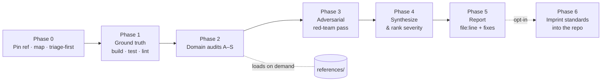

# Deep Code Review

**A universal, evidence-grounded code-review skill you can drop into any
repository.** It turns "look this over" into a rigorous, reproducible audit that
covers correctness, security, AI/LLM safety, data quality, performance and cost,
reliability, testing, infrastructure, docs, and accessibility — and ends with a
severity-ranked report you can act on. Works in any language or stack, on any
major coding agent (Cursor, Claude Code, Codex, Copilot, Gemini, Aider, …), as a
one-shot prompt, or as a human checklist.

---

## The problem it solves

An ad-hoc read-through finds the obvious bugs and misses the expensive ones: the
IDOR that leaks another tenant's data, the enrichment run that silently
overwrites a verified value with a blank, the N+1 that shows up only under load,
the LLM call that trusts a scraped web page as an instruction, the migration
that locks a table during deploy, the API called "every run" that quietly grows
the bill. Deep Code Review makes the review **systematic** — a fixed method,
domain checklists mapped to current standards, an adversarial pass, and a report
format — so the same rigor applies every time, on any project, by a human or an
agent.

Two things make it more than a checklist:

- **It judges the outcome, not just the code.** For data and ML pipelines it
  audits what the code *produces* — fabrication, duplication, entity-merge
  errors, silent quality regressions — against a hard "quality can only improve,
  never silently degrade" invariant.
- **It leaves the bar in place.** An optional final phase imprints a tailored
  standards set — a canonical cross-vendor `AGENTS.md` (with `CLAUDE.md` and peer
  agent files as thin pointers to it), pre-commit/CI gates, and templates — into
  the reviewed project so the *next* contributor or agent (any vendor) holds the
  same quality, security, and efficiency bar without re-deriving it.

---

## What it checks

The method walks nineteen domains (A–S); each has a red-flag list in `SKILL.md`
and a deep detection playbook in `references/`.

| Domain | Covers | Deep reference |
|---|---|---|
| A Correctness | logic, edge cases, money precision, time/UTC | — |
| B App security | OWASP Top 10:2025, injection, SSRF, authz, secrets | `security-appsec.md` |
| C AI / LLM / agents | OWASP LLM Top 10:2025 + Agentic 2026, injection, output handling | `security-ai-agents.md` |
| D Data integrity | monotonic quality, no-fabrication, entity resolution, evals | `data-quality.md` |
| E Performance & cost | N+1, indexes, migrations, API/LLM spend | `performance-db-cost.md` |
| F Reliability | error handling, retries, idempotency, rollbacks | `reliability-error-handling.md` |
| G Concurrency | races, TOCTOU, shared-state writes | `concurrency-shared-state.md` |
| H Maintainability | dead code, duplication, feature flags, lockstep surfaces | — |
| I APIs & integration | contracts, webhooks, message-schema evolution | `api-contracts.md` |
| J Testing & evals | taxonomy, test-the-failure, AI eval harness | `testing-and-evals.md` |
| K Build / CI / supply chain | reproducible build, SHA-pinned actions, SBOM, signatures, dependency currency & safe upgrades | `dependency-currency-and-upgrades.md` |
| L Infra / IaC / cloud | Docker, K8s, Terraform, IAM, network exposure | `infra-iac-containers.md` |
| M Observability | logs/metrics/traces, golden signals, audit integrity, restore drills | `observability.md` |
| N Config & secrets | env-only secrets, safe defaults, clean no-op | — |
| O Docs & DX | Diátaxis, C4, ADRs, one-command setup, repo hygiene, cross-agent imprint | `docs-and-dx.md` |
| P Frontend / a11y | WCAG 2.2 AA, Core Web Vitals, plus the *design half* (five data states, encoding, metric deltas) | `frontend-a11y.md`, `product-ux-quality.md` |
| Q Privacy & licensing | minimization, retention/erasure, consent flags, license compat | `privacy-compliance.md` |
| R i18n & encoding | locale-aware formatting, Unicode normalization | — |
| S Branches & open-work triage | branching model, merge/PR/rebase/delete per branch, squash-merge detection, safe cleanup | `branch-and-merge-hygiene.md` |
| + | per-language grep-able footguns | `language-stack-redflags.md` |

Plus a dedicated **adversarial / red-team pass** and a **useless-work audit**
(cost with no value: repeated identical API/LLM/DB calls, over-fetching,
"call it every run" patterns).

---

## How to use it

**Install into a project** (agent-agnostic — copies skills into the skill
roots major hosts discover, and writes a version-stamped `AGENTS.md` pointer).
Default is **review only**. Overlays are opt-in. An agent should run
`--recommend` and let the owner decide before `--full`.

```bash
git clone https://github.com/remigiusz-antczak/deep-code-review.git
cd deep-code-review
./install.sh /path/to/your/project                 # review only (.agents + .cursor + .claude + AGENTS.md)
./install.sh --recommend /path/to/your/project     # inspect; print a pack; write nothing
./install.sh --with-delivery /path/to/your/project # + gated delivery overlay
./install.sh --with-critic /path/to/your/project   # + pre-owner idea critic
./install.sh --full /path/to/your/project          # review + delivery + critic
./install.sh --with-codex /path/to/your/project    # also .codex/skills/
./install.sh --with-extra-hosts /path/to/your/project  # Gemini, OpenCode, Copilot, Windsurf, Hermes, Kiro
./install.sh --minimal /path/to/your/project       # only .claude/skills/ + AGENTS.md
./install.sh --claude-only /path/to/your/project   # only .claude/skills/ (no AGENTS.md)
```

Superpowers makes the agent disciplined. Spec Kit makes the spec durable.
This repo makes the **bar** portable — review, security, data integrity, and
(opt-in) gated delivery — so any agent on any repo is judged the same way.
Do not also install a second delivery OS on the same project.

### Stand up a software-house in your repo (opt-in)

The review skill is the **bar**. Its two sibling skills turn a repo into a
disciplined software-house — the same roles, gates, and doctrine a top team runs —
without standing up a bot per role:

- **`agentic-delivery`** — gated **G0–G10** delivery and the full **role roster as
  hats** (Conductor, Product Analyst, Architect, Implementer, Evil Twin, QA,
  Security, UX & Design, Release, Docs; `references/roles.md`), one writer per
  worktree, exact-SHA receipts, and human approval on every outward action. It
  names `deep-code-review` at specification, review, and integrate.
- **`idea-critic`** — the "proper evil twin": attacks a plan or a "we should"
  *before* the owner sees it, defaults to dissent, and verifies its own objection
  against current state (a critic is a lead, not an oracle).

Let an agent inspect the target first — `./install.sh --recommend <project>`
reports which quality gates the repo already has and proposes the roles plus the
gates that are missing. The owner decides; the default install stays review-only.
Roles are **hats that fire from risk, not headcount** — start with the fewest the
change needs, grounded in how multi-agent software frameworks (MetaGPT, ChatDev)
and Anthropic's *Building Effective AI Agents* decompose the work.

Chat voice is not vendored. If a project wants compressed assistant prose,
add [JuliusBrussee/caveman](https://github.com/JuliusBrussee/caveman)
separately. Code, PR bodies, and docs stay normal English.

Re-running refreshes the AGENTS.md stamp. Personal/global Cursor install: copy
to `~/.cursor/skills/deep-code-review/` (and optionally `~/.agents/skills/` /
`~/.claude/skills/`).Then in that project (any agent):

```
/deep-code-review FULL                   # slash-skill hosts
# or: "run a deep code review FULL on this repo"
/deep-code-review DIFF origin/main
/deep-code-review FILE src/auth.ts
```

**As a one-shot prompt** — paste the installed `SKILL.md` into any capable model,
then name the target and scope.

**As a human checklist** — walk the domain sections (A–S) directly.

**Discovery** — Cursor / Agent Skills / Claude Code / Codex load from
`.agents/skills/`, `.cursor/skills/`, `.claude/skills/`, and/or `.codex/skills/`
(see Cursor Agent Skills docs). The root `AGENTS.md` pointer is the
cross-vendor fallback when a host does not auto-load skills.
---

## How it works



The report is severity-ranked (Blocker → Critical → High → Medium → Low → Nit),
every finding carries `file:line` evidence and a concrete fix, and unverifiable
items are marked `unverified` rather than guessed. Fan-out findings are
`CONFIRMED`, `CORROBORATED`, or `PLAUSIBLE`. See `SKILL.md` for the exact report
format and the definition of done.

On a git checkout the review **pins an immutable ref** (`START_SHA`) and, for
`FULL`, prefers a dedicated worktree so a concurrent agent cannot change what is
being read mid-audit. The plain-language report lands in top-level `code-review/`
when the tree is idle — or out-of-tree / on a dedicated review branch when the
checkout is shared or occupied — a traffic-light health scorecard, the top risks
in human terms, and the decisions that need an owner, so a founder or leader can
act without reading the code. A worked fictional example is in
[`docs/example-review-report.md`](docs/example-review-report.md).

---

## Standards it tracks

Verified for this release (full list with URLs and verification dates in
[`docs/standards-index.md`](docs/standards-index.md)): OWASP Top 10:2025 (incl.
the A03 supply-chain detail), OWASP Top 10 for LLM Applications 2025, OWASP Top 10
for Agentic Applications 2026, OWASP API Security Top 10 (2023), OWASP ASVS 5.0,
CWE Top 25 (2025), WCAG 2.2, Google Engineering Practices, Diátaxis, the C4 model,
Semantic Versioning, OpenSSF Scorecard, OpenSSF Best Practices Badge, OSV, GitHub
Dependabot, Keep a Changelog, pre-commit, EditorConfig, Development Containers,
AGENTS.md, the GitHub community-health + Claude Code memory docs, and Cursor
Agent Skills directory docs. For the software-house overlay and
agent-orchestration discipline (verified 2026-09-08): Anthropic's *Building
Effective AI Agents*, the Claude Code Subagents and Agent Skills documentation,
and the MetaGPT and ChatDev multi-agent papers. Referenced
by name (verify the current version before citing): OWASP WSTG, MITRE ATLAS, NIST
SSDF and AI RMF, SLSA, CIS Benchmarks, ISO/IEC 25010, Twelve-Factor, Conventional
Commits, Nielsen's usability heuristics (named, no URL), and the per-agent
instruction-file conventions (Cursor, Copilot, Windsurf, Gemini, Aider).

Standards move. The skill instructs the reviewer to **fetch the current version
before relying on version-specific detail, and to cite only URLs it has
verified** — never a remembered link.

---

## Repository layout

```
.
├── README.md                       # this file (human-facing)
├── CLAUDE.md                       # AI-facing standards for working in THIS repo
├── install.sh                      # copy skills into a target project
├── .banlist.txt                    # privacy-gate seed (dogfooded)
├── .claude-plugin/plugin.json      # Claude Code marketplace manifest
├── docs/
│   └── standards-index.md          # verified standards, URLs, verification dates
└── .claude/skills/
    ├── deep-code-review/           # default product — the review bar
    ├── agentic-delivery/           # opt-in gated delivery + role roster (references/roles.md)
    └── idea-critic/                # opt-in pre-owner idea attack (the "evil twin")
```

`deep-code-review/references/` holds on-demand depth (method, domain
checklists, report format, plus per-domain playbooks). Count routed depth
files, not copies of `docs/`.

---

## Confidentiality & no fabrication

The skill enforces — and this repository dogfoods — two hard rules: **no
fabrication** (skip or flag rather than guess; no invented findings, data,
sources, metrics, CWEs, or line numbers) and **no private/identifying data** in
any committable artifact — secrets, PII, third-party/private real names, private
company/team names, internal identifiers, private hostnames, or identifying URLs —
including git history. A project's **own intended-public identity** may stand only
when required and corroborated by an existing project-owned public artifact, with
drift treated as a finding. All examples use fictional placeholders (`Acme Capital`,
`jane@example.com`). A privacy gate that finds a secret reports its `file:line` and
never echoes the secret itself.

## Attribution & license

Inspired by open Claude Code setups (including
[`nickmaglowsch/claude-setup`](https://github.com/nickmaglowsch/claude-setup))
and grounded in the public standards listed above. Released under the
[MIT License](LICENSE).
